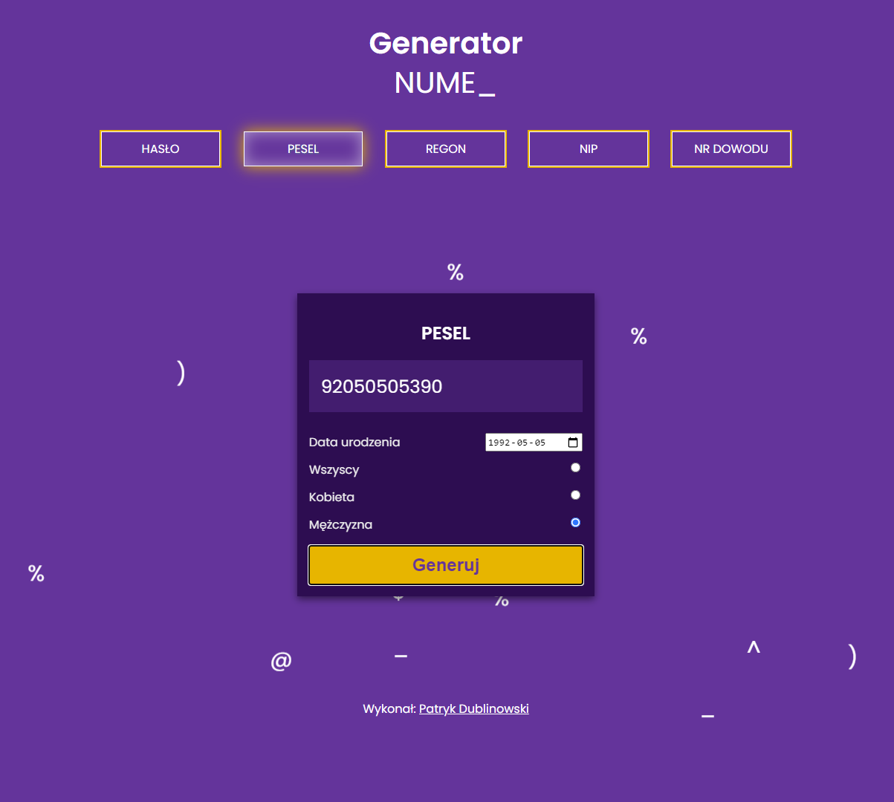
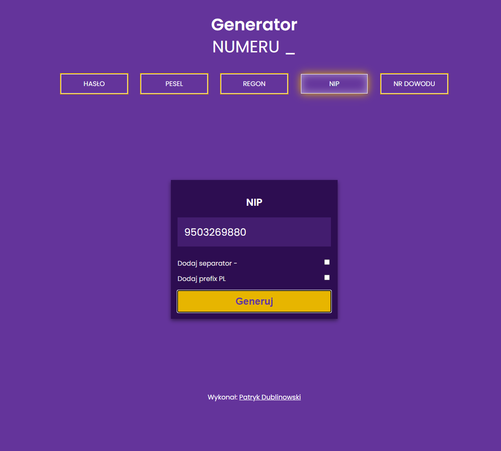

# Generator
> This is website which generate password, PESEL, NIP, REGON and ID Number.

## Table of contents
* [General info](#general-info)
* [Screenshots](#screenshots)
* [Technologies](#technologies)
* [Features](#features)
* [Status](#status)
* [Inspiration](#inspiration)
* [Contact](#contact)

## General info
This is website which generate random values useful to create password. Website is able too to generate PESEL, NIP, REGON and ID Number. The generated values are fully validated. Will be useful for programmers or testers.

After generate some values user can copy them to clipboard with one click on the area where the generated values appear (when you hover over this field, the copy button appears). After copying, the page on the right indicates that the value is already in the clipboard.

The website except of generate functionality has a couple interesting animation effects. For instance automaticaly text writing animation or after click each generate button the website show us falling characters on the background.

The website is fully scalable so is adapted to be used on phones or tablets.

## Screenshots

## Technologies
* JS
* HTML
* CSS

External add-ons:

TOASTR - https://codeseven.github.io/toastr/

## Features
List of features ready and TODOs for future development
* Add a new generator if necessary

To-do list:
* Design and create a page view
* Create responsive menu as buttons
* Create changing content without refresh page (for each generator)
* Add some effects to increasing the attractiveness of the website
* Add generators for password, PESEL, NIP, REGON, ID Number
* Add some effect like falling random characters - after click each generate button
* Make the menu more convenient on mobile devices

## Status
Project is: _finished

## Inspiration
For refresh my JS, CSS and HTML knowledge and for my own needs - generators are really usefull for programmers :) 

## Contact
Created by [@PatrykDublinowski] - feel free to contact me!
